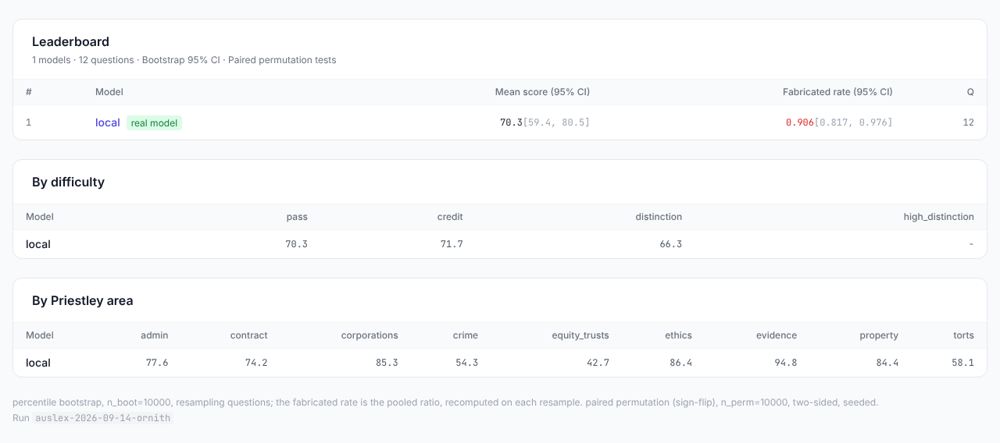
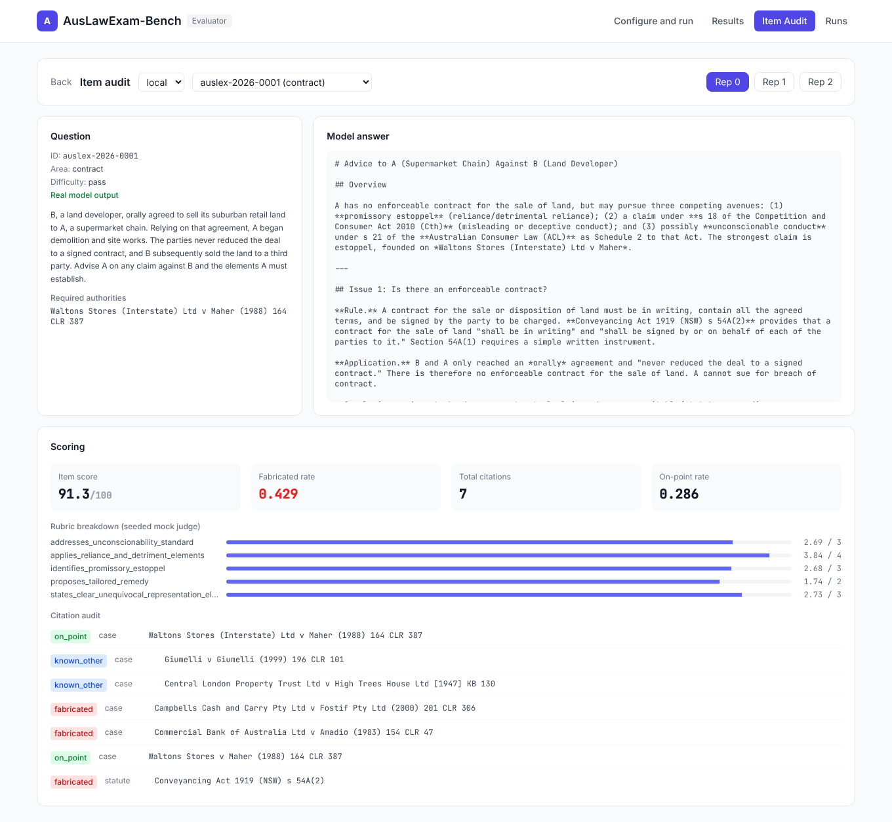
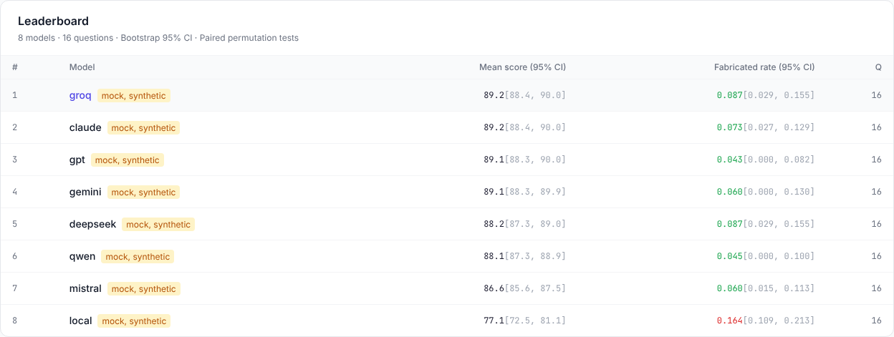
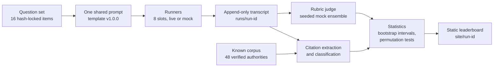

<div align="center">

# AusLawExam-Bench

### A reproducible benchmark of Australian legal reasoning for LLMs, scored on how often a model invents a citation

    

</div>

<br>

> In law, a confidently wrong citation is worse than an admitted gap.  A model that invents a leading case or misstates a section number can mislead as badly as one that writes nothing at all.  This benchmark checks every citation a model produces against known Australian authority, so **a model that scores well on the rubric while inventing cases shows up as exactly that**.

<br>

## What it is

AusLawExam-Bench puts exam-style questions on Australian law to eight model slots, one each for GPT, Claude, Gemini, Groq, DeepSeek, Mistral, and Qwen, plus a local open-weight slot.  Every model gets the same versioned prompt, at temperature 0 where the model accepts it.  Current Claude models reject a temperature setting and GPT reasoning models accept only the default, so those slots run at the model default and the three repetitions measure the variance.  The harness extracts each citation from each answer, classifies it as real or fabricated, scores the answer against a rubric, and publishes the raw outputs next to the scores so anyone can audit a number end to end.

> [!CAUTION]
> This is a benchmarking prototype and gives no legal advice.  It does not answer legal questions or verify legal propositions.  The 16 shipped questions are provisional drafts that no qualified Australian lawyer has reviewed, and their gold answers and required authorities may contain errors.  Do not rely on them, or on any model output the benchmark produces, for a real legal decision.

It is a working prototype.  The full pipeline runs offline on deterministic seeded mocks, and each commercial slot switches on when its API key is present.

<br>

## Results

One real model has been scored so far, a local open-weight model on the local slot.  No commercial slot has been run, because there are no commercial API keys in the run environment.

> [!NOTE]
> The seven commercial slots are wired and tested against mocked HTTP, covering success, refusal, truncation, and HTTP errors, but none has been run against a live API.  Before a live run, `auslex estimate --models claude,gpt,gemini --reps 3` prints the call count and an estimated cost for each slot.  It is an estimate: input tokens come from prompt length, output assumes the committed local run's mean answer length, and thinking tokens are not included.  A model without a confirmed price shows `unknown` until one is passed with `--price`.

### A real run on the local slot

Run `auslex-2026-09-14-ornith` put the 16 provisional items to a local model of about 35.5B parameters, served as GGUF by llama.cpp through an OpenAI-compatible endpoint (`ornith-agent-strix`, context window 131072).  The server does not report the exact quantisation.  It used the shared prompt template v1.0.0 at temperature 0, with three repetitions per item, for 48 completions, of which 48 finished and 0 errored.  Dataset 0.2.0 then corrected the answer key, and four items changed their question text, so the scores below cover the 12 unchanged items and their 36 completions.  All 48 raw outputs stay committed.

```bash
AUSLEX_LOCAL_BASE_URL=http://localhost:10009/v1 \
AUSLEX_LOCAL_MODEL=ornith-agent-strix \
auslex run --models local --reps 3 --seed 0 --run-id auslex-2026-09-14-ornith
```

| Metric | Value (95% CI) | What it actually measures |
|---|---|---|
| Mean rubric item score (0 to 100) | **70.3** [59.4, 80.5] | The deterministic seeded rubric judge, not a human legal grade |
| Citations by class, `on_point` / `known_other` / `fabricated` | **9 / 11 / 194** of 214 | Automated match against the item's required authorities and a 48-entry known corpus |
| Fabricated-citation rate (upper bound) | **0.906** [0.817, 0.976] | Share of extracted citations the matcher could not confirm |

> [!IMPORTANT]
> The headline rate here reflects the small known corpus more than the model.  Of the 194 unmatched citations, 22 are bare report tails that the extractor could not pair with a party name.  The rest mix real but uncatalogued authorities, including 28 English citations in series such as the Appeal Cases, with citations that still need a legal check.  **The true fabricated-citation rate is materially below 0.906 and is UNVERIFIED** until a citation-by-citation legal review is done.

<p align="center"></p>

*The web UI's leaderboard for run `auslex-2026-09-14-ornith`.  Its one row is real output from the local model, scored on the 12 items unchanged since the run.*

<p align="center"></p>

*The item audit for one real answer (item 0001, repetition 0): the question and its required authority, the model's answer, the seeded mock judge's rubric marks, and the class of every extracted citation.  A `fabricated` label means the matcher could not confirm the citation against its 48-entry corpus, so it is an upper bound, not a finding that the case is invented.*

The raw outputs, scores, intervals, and rendered leaderboard for this run are committed under `runs/`, `scores/`, `stats/`, and `site/`, each in an `auslex-2026-09-14-ornith` folder.  Re-derive them with `auslex score`, `auslex stats`, and `auslex site` on `runs/auslex-2026-09-14-ornith`.

### Mock run

The table below comes from a mock run of 16 questions and three repetitions with no API keys, so **every number in it is synthetic**.  It shows the metric working and says nothing about any real model.  Reproduce it with this command.

```bash
auslex run --reps 3 --mock --run-id auslex-mock --out-root /tmp/auslex-mock
```

| # | Slot | Mean score (95% CI) | Fabricated rate (95% CI) |
|:--:|---|---|---|
| 1 | groq | 89.2 [88.4, 90.0] | 0.087 [0.029, 0.155] |
| 2 | claude | 89.2 [88.4, 90.0] | 0.073 [0.027, 0.129] |
| 3 | gpt | 89.1 [88.3, 90.0] | 0.043 [0.000, 0.082] |
| 4 | gemini | 89.1 [88.3, 89.9] | 0.060 [0.000, 0.130] |
| 5 | deepseek | 88.2 [87.3, 89.0] | 0.087 [0.029, 0.155] |
| 6 | qwen | 88.1 [87.2, 88.9] | 0.045 [0.000, 0.100] |
| 7 | mistral | 86.6 [85.6, 87.5] | 0.060 [0.015, 0.113] |
| 8 | local | 77.1 [72.5, 81.1] | 0.164 [0.109, 0.213] |

<p align="center"></p>

*The same leaderboard for the mock run above.  Every row is mock, synthetic output, badged as such, and says nothing about any real model.*

The mock runner seeds on the run seed, the slot, and the item id, so anyone can reproduce these exact numbers offline without an API key.  Every completion carries an `is_mock` flag from end to end, and the leaderboard labels mock rows as synthetic rather than presenting them as model output.

<br>

## How it works



### The headline metric

For every answer, the harness extracts the citations and puts each one in a class.

| Class | Meaning |
|---|---|
| `on_point` | Matches one of the item's required authorities |
| `known_other` | A real authority from the known corpus, but not one on this item's list |
| `fabricated` | Looks like a citation but appears in neither list, so the checker could not confirm it.  Because the known corpus is small, this class also collects real but uncatalogued or abbreviated citations, so it is an upper bound on invention rather than a direct count |

```text
fabricated_rate = fabricated / total_citations
```

A model can score well on rubric items and still have a high fabricated rate.  That gap is what the benchmark exists to expose.

The fabricated rate is pooled over every citation a slot makes, and its 95% interval resamples questions and recomputes the same pooled rate, so the point always describes the same statistic as its interval.

> [!NOTE]
> The extractor reads full case citations, including names in markdown italics, medium-neutral citations such as `[2021] HCA 19`, year-ordered reports such as `[1932] AC 562`, and Act or rule citations that give a jurisdiction and a section or rule.  A bare report that repeats a fuller citation in the same answer counts once, and an abbreviated party name on the right report still matches.  Party names keep lowercase joining words, as in `Commercial Bank of Australia Ltd`.  It still misses short forms such as `Waltons at 404` or `ibid`, a section cited without its Act, sections of the Constitution, and report series written with a space, such as `Qd R`.  Those go uncounted rather than counted as fabricated.

> [!WARNING]
> With 16 questions the known corpus is small, so a real Australian citation that is not yet catalogued counts as `fabricated`.  The reported rate is a conservative upper bound on true hallucination rather than a precise estimate.  [paper/ANALYSIS_PLAN.md](paper/ANALYSIS_PLAN.md) sets out how the bound tightens as the question set grows toward 100 to 200 items.

### Scoring pipeline

| Stage | Command | What happens | Output |
|---|---|---|---|
| **Run** | `auslex run` | Sends the shared prompt for every model, item, and repetition, at temperature 0 where the model accepts it | `records.jsonl` |
| **Score** | `auslex score` | Extracts and classifies citations, then applies the rubric judge to each completion | `scored.jsonl` |
| **Stats** | `auslex stats` | Computes percentile bootstrap 95% confidence intervals and paired sign-flip permutation tests, 10,000 resamples each | `report.md` |
| **Site** | `auslex site` | Renders a static leaderboard page with inline CSS and no JavaScript | `index.html` |

The mock judge is a seeded ensemble of three judges, so the whole pipeline runs offline and deterministically with no configuration.

### Reproducibility

| Principle | What it means |
|---|---|
| **One shared prompt** | No model gets its own prompt tuning.  Every model receives the identical versioned template, and `runs/<id>/meta.json` records the version. |
| **Append-only runs** | The record log is only ever appended to and each raw output is written once; only `meta.json` is finalised when the run ends, so any tampering would show. |
| **Content-hashed items** | Each item carries its SHA-256 content hash, `data/gold/manifest.json` records every hash, and every output records the hash and prompt of the item it answered, so every score can be audited against the raw output it came from. |
| **Contamination canaries** | Every item carries a global canary (`auslex:9f2c1a4e-7b3d`) and a per-item canary derived from its id.  A model that reproduces either one verbatim has probably seen the item in training.  See [data/canary.txt](data/canary.txt). |

<br>

## Quick start

```bash
pip install -e .
auslex run --reps 3 --mock
```

That one command runs the whole pipeline offline.  It sends the shared prompt to every configured slot through the seeded mock runner, scores citations and rubric items, computes the intervals and permutation tests, and renders a static leaderboard page.  No API keys are needed.  Without `--mock`, a slot with no API key, a local slot with no model named, or a local endpoint that does not answer, is skipped rather than mocked.

```bash
pip install -e ".[dev,ui]"
python3 -m pytest
ruff check . && ruff format --check . && mypy
```

The 145 tests across 16 files cover schema validation, canary derivation and detection, the Australian-jurisdiction filters, citation extraction and classification, the permutation test, content hashing, mock runner determinism, a full run from mock to site, CLI parsing, the FastAPI endpoints, the served web client and its default paths, the secrets store, the Claude, OpenAI-compatible, Gemini, and local runners against mocked HTTP, the hash lock, the interval statistics, concurrent runs with retry, the public site builder, and the cost estimate.

<br>

## Usage

### Commands

```bash
# Validate the question set (schema, Australian-jurisdiction rule, canary presence)
auslex validate --questions data/questions/auslex.jsonl

# Stamp each item's content hash and write data/gold/manifest.json
auslex validate --lock

# View the leaderboard locally
python3 -m http.server --directory site/<run-id> 8080

# Check a local OpenAI-compatible endpoint
auslex probe-local --list

# Count the calls and estimate the cost of a live run before spending anything
auslex estimate --models claude,gpt,gemini --reps 3

# Re-score, re-run the statistics, or rebuild the site on their own
auslex score runs/<run-id>
auslex stats runs/<run-id>
auslex site runs/<run-id>

# Build the public site from committed real runs only, as the Pages workflow does
auslex pages --out _site

# Export for Hugging Face
auslex export-hf --out export/hf
```

The `Pages` workflow builds that site on every push to `master` and deploys it to GitHub Pages.  It publishes a run only if every slot in it ran a real model, so mock numbers never reach the public site.

### Run flags

| Flag | Effect | Default |
|---|---|---|
| `--models local,gpt` | Runs a subset of slots | All slots |
| `--reps N` | Repetitions per item | `3` |
| `--mock` | Falls back to the mock runner for any slot with no API key | Off |
| `--concurrency N` | Calls in flight at once; records keep a fixed order | `4` |
| `--max-retries N` | Extra attempts, with exponential backoff, for rate limits, server errors, and network failures | `2` |
| `--out-root <dir>` | Folder that receives `runs/`, `scores/`, `stats/`, and `site/` | The repository |
| `--config <file>` | JSON overrides per slot, such as `{"models": {"gpt": {"model": "..."}}}` | None |
| `--run-id <id>` | Names the run | `auslex-` and a UTC timestamp |
| `--n-boot N`, `--n-perm N` | Bootstrap and permutation resamples | `10000` each |

### Web UI

```bash
pip install -e ".[ui]"
auslex-ui      # serves http://localhost:8000
```

The UI is a FastAPI server with a React and Vite client.  A built copy of the client ships in `src/auslex/publish/assets`, so Node.js is not needed to run it.  After changing `frontend/`, run `npm install` and `npm run build` there, and the server serves that build in place of the shipped copy.  Copy `frontend/dist` over `src/auslex/publish/assets` to update the shipped copy.  API keys are stored in `~/.auslex-ui/keys.json` with mode 0600 and are sent only to the provider each key belongs to.  There is no telemetry.

<br>

## Reference

### Model slots

Configuration lives in [src/auslex/config.py](src/auslex/config.py).  A config file overrides the defaults, and the environment overrides both.

| Slot | Vendor | Model | Live when | Mock profile |
|---|---|---|---|---|
| gpt | OpenAI | gpt-5.6 | `OPENAI_API_KEY` is set | quality 0.86, fab 0.08 |
| claude | Anthropic | claude-opus-5-5 | `ANTHROPIC_API_KEY` is set and the `claude` extra is installed | quality 0.83, fab 0.10 |
| gemini | Google | gemini-3.1-flash-lite | `GOOGLE_API_KEY` is set | quality 0.80, fab 0.13 |
| groq | Groq | openai/gpt-oss-120b | `GROQ_API_KEY` is set | quality 0.82, fab 0.10 |
| deepseek | DeepSeek | deepseek-chat | `DEEPSEEK_API_KEY` is set | quality 0.78, fab 0.12 |
| mistral | Mistral | mistral-small-latest | `MISTRAL_API_KEY` is set | quality 0.75, fab 0.14 |
| qwen | Qwen | qwen3-max | `DASHSCOPE_API_KEY` is set | quality 0.76, fab 0.13 |
| local | OpenAI-compatible | Set by `AUSLEX_LOCAL_MODEL` | The model is named and `base_url` answers | quality 0.55, fab 0.25 |

### Claude slot

The Claude slot runs on the official `anthropic` SDK.  Install it with `pip install -e ".[claude]"`, then run `ANTHROPIC_API_KEY=... auslex run --models claude --reps 3`.

| Setting | Value | Why |
|---|---|---|
| Model | `claude-opus-5-5` | The current default Claude model |
| Sampling | None sent | The model rejects `temperature`, `top_p`, and `top_k` |
| Effort | `high`, set explicitly | Opus 5.5 defaults to `medium` and its thinking cannot be switched off |
| Output budget | 32,000 tokens, streamed | Room for an essay answer plus thinking |
| Refusal or truncation | Recorded as an error | The answer is kept for audit but not scored |
| Server-side fallback | Off | A fallback would answer with a different model and silently change what is measured |

### Local slot

| Variable | Default | Purpose |
|---|---|---|
| `AUSLEX_LOCAL_BASE_URL` | `http://localhost:10000/v1` | OpenAI-compatible endpoint |
| `AUSLEX_LOCAL_MODEL` | None, required | The model name the server exposes, as `auslex probe-local --list` shows it |
| `AUSLEX_LOCAL_ENABLE_THINKING` | `0` | Off by default, because a thinking model spends its whole `max_tokens` budget in `reasoning_content`.  Set it to `1` to opt in. |

### Question set

The 16 provisional items cover all four exam formats and all eleven Priestley areas, in Commonwealth, New South Wales, Victorian, Queensland, and Western Australian law.  Each item is hash-locked: `auslex validate` fails if an item changes without a new lock, a version bump, and a changelog entry.

| Type | Example question | Marks |
|---|---|:--:|
| Short answer | *State and explain the standard of proof in a criminal trial, and the meaning of 'beyond reasonable doubt'* | 10 |
| Multiple choice | *Which best states the Australian position on the duty to warn?* | 4 |
| Hypothetical | *B, a land developer, orally agreed to sell its suburban retail land to A [...] Advise A* | 15 |
| Essay | *Discuss, with reference to the authorities, when a person who makes a negligent misstatement can be held liable for pure economic loss* | 20 |

<br>

## Layout

```text
src/auslex/
  schema.py        Pydantic contract for the QuestionItem model
  config.py        Eight-slot roster, driven by config and environment
  pricing.py       Confirmed model prices for cost reporting and estimates
  prompts.py       The single versioned prompt template
  canary.py        Contamination detection
  io.py            JSONL reading and writing, SHA-256 content hashing
  run/             Orchestrator and append-only storage
  runners/         Mock, local, OpenAI, Anthropic, and Google runners
  score/           Citation extraction and classification, rubric judge
  stats/           Bootstrap intervals, permutation tests, report renderer
  ingest/          Validation, Australian-jurisdiction rule, dedup, hash-lock
  publish/         Static leaderboard site, GitHub Pages builder, Hugging Face export, built web client

backend/           FastAPI server for the web UI
frontend/          React and Vite dashboard
data/              Question set, canaries, gold manifest
docs/images/       README screenshots
paper/             Methodology, contamination statement, analysis plan
tests/             145 tests
```

<br>

## Contributing

Open an issue, or get in touch directly.  The priorities are lawyer verification of the provisional items, a larger citation corpus to tighten the fabricated-rate bound, and growth toward the target of 100 to 200 questions.  [paper/ANALYSIS_PLAN.md](paper/ANALYSIS_PLAN.md) sets out the planned analysis.

<br>

## Licence

The licence has two parts.  The harness and code (`src/`, `tests/`, `paper/`, and the packaging) are under Apache-2.0.  The question data is under CC BY 4.0.  See [LICENSE](LICENSE).
